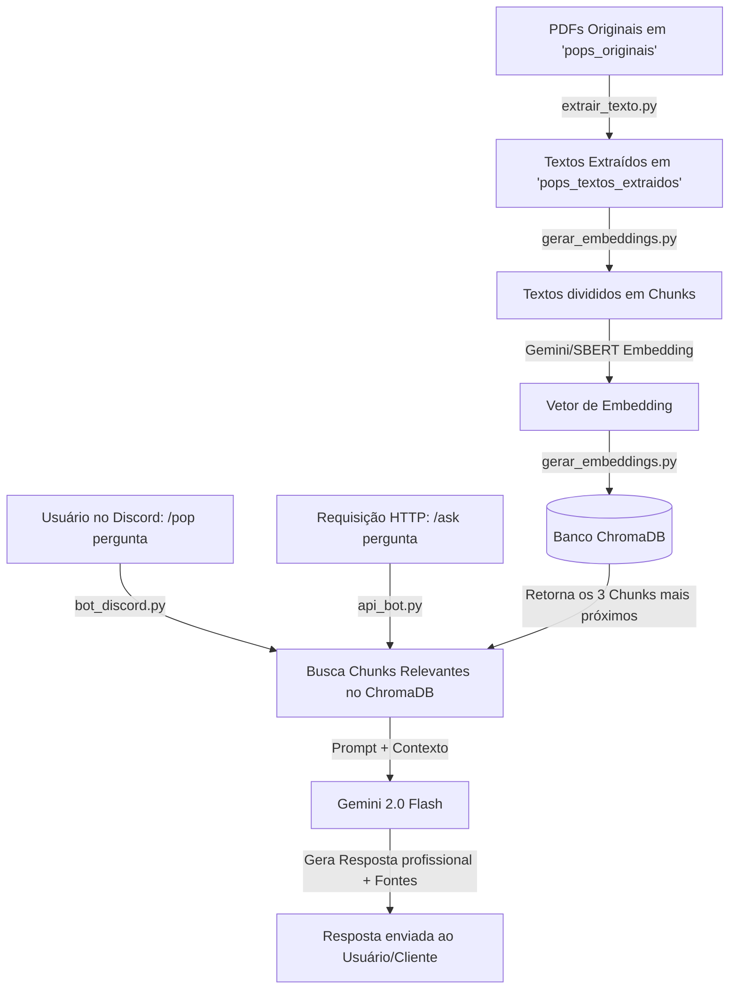

# POPS AI - Assistente de POPs para Discord & API com RAG & Gemini

Este repositório contém uma aplicação completa de **RAG (Retrieval-Augmented Generation)** projetada para responder a perguntas sobre os **Procedimentos Operacionais Padrão (POPs)** da sua empresa. O sistema conta com um pipeline de ingestão de documentos (extração de texto e geração de embeddings), um banco vetorial local (**ChromaDB**), um bot de **Discord** com comandos interativos (incluindo upload de novos POPs em tempo de execução) e uma API **FastAPI** integrada, tudo orquestrado para rodar em paralelo usando a API do **Google Gemini** (suportando Gemini 2.0 Flash) ou embeddings locais com **SBERT**.

---

## 🚀 Como Funciona o Projeto

O projeto é dividido em três etapas principais, além da interface de consulta:



1. **Extração (`extrair_texto.py`)**: Lê os PDFs colocados na pasta `pops_originais`, extrai o texto completo e salva em formato `.txt` na pasta `pops_textos_extraidos`. Também extrai imagens das páginas e salva em `pops_imagens_extraidas` para uso futuro.
2. **Geração de Embeddings (`gerar_embeddings.py`)**: Lê os textos extraídos, divide em pedaços menores (chunks) usando o `RecursiveCharacterTextSplitter` da LangChain, gera os vetores de embedding usando o modelo configurado (Gemini `models/embedding-001` ou HuggingFace SBERT local) e os armazena no banco de dados vetorial local **ChromaDB**.
3. **Interface de Consulta (Discord & API)**:
   * **Bot do Discord (`bot_discord.py`)**: Disponibiliza os comandos:
     * `/pop <pergunta>`: Consulta a base de dados vetorial e gera a resposta via Gemini.
     * `/addpop <arquivo.txt>`: Permite que administradores enviem um novo POP em formato `.txt` diretamente pelo Discord, indexando-o na base vetorial em tempo real.
   * **API FastAPI (`api_bot.py`)**: Disponibiliza o endpoint POST `/ask` para integrar a base de conhecimento de POPs com outros sistemas internos da empresa.

---

## 🛠️ Tecnologias Utilizadas

- **Python 3.10**
- **Discord.py**: Integração com a API do Discord e Comandos de Barra (Slash Commands).
- **FastAPI & Uvicorn**: API REST rápida para expor o serviço de consultas.
- **Supervisor**: Gerenciamento de processos para rodar o Bot do Discord e a API FastAPI em paralelo dentro do mesmo container.
- **Google Generative AI SDK**: Modelos `gemini-2.0-flash` (geração de texto) e `models/embedding-001` (vetorização).
- **Sentence-Transformers (HuggingFace)**: Alternativa local para embeddings (`paraphrase-multilingual-mpnet-base-v2`).
- **ChromaDB**: Banco de dados vetorial leve e embarcado.
- **PyPDF2** & **PyMuPDF (fitz)**: Extração de texto e imagens de documentos PDF.
- **LangChain Text Splitters**: Divisão inteligente e sobreposta de textos (Chunking).
- **Docker & Docker Compose**: Para empacotamento, orquestração e deploy simplificado.

---

## ⚙️ Configuração dos Modelos (`config.py`)

O arquivo `config.py` centraliza as decisões sobre os modelos que a aplicação utilizará. Você pode configurar:

- **Modelo de Embedding (`ACTIVE_EMBEDDING_MODEL`)**:
  - `EmbeddingModelType.GEMINI`: Usa a API do Google Gemini (`models/embedding-001`). Requer conexão com a internet e API key.
  - `EmbeddingModelType.HUGGINGFACE_SBERT`: Executa localmente o modelo `paraphrase-multilingual-mpnet-base-v2` para geração de vetores. Excelente para evitar custos de API ou limites de requisição.
- **Modelo Generativo (`ACTIVE_GENERATIVE_MODEL`)**:
  - `ACTIVE_GENERATIVE_MODEL`: Por padrão configurado como `gemini-2.0-flash` no factory, oferecendo velocidade absurda e respostas precisas.

---

## 📋 Pré-requisitos

Para rodar este projeto, você precisará de:
1. Uma **Chave de API do Google Gemini** (gratuita ou paga). Crie a sua no [Google AI Studio](https://aistudio.google.com/).
2. Um **Token de Bot do Discord**. Crie sua aplicação no [Discord Developer Portal](https://discord.com/developers/applications).

### Configuração do Bot no Discord Developer Portal
1. No painel da sua aplicação no Discord, vá em **Bot**.
2. Ative a opção **Message Content Intent** (necessário para o bot receber mensagens e interagir).
3. Vá em **OAuth2** -> **URL Generator**.
4. Selecione os escopos: `bot` e `applications.commands`.
5. Selecione as permissões do bot:
   - *Read Messages/View Channels*
   - *Send Messages*
   - *Use Slash Commands*
6. Copie a URL gerada, cole no seu navegador e adicione o bot ao servidor desejado.

---

## ⚙️ Instalação e Configuração Passo a Passo

### Opção 1: Execução Local (Python)

#### 1. Clonar o Repositório
```bash
git clone https://github.com/seu-usuario/seu-repositorio.git
cd seu-repositorio
```

#### 2. Criar e Ativar Ambiente Virtual
No Windows:
```bash
python -m venv venv
venv\Scripts\activate
```
No Linux/macOS:
```bash
python3 -m venv venv
source venv/bin/activate
```

#### 3. Instalar Dependências
```bash
pip install -r requirements.txt
```

#### 4. Configurar Variáveis de Ambiente
Copie o arquivo de exemplo e preencha com suas chaves:
```bash
cp .env.example .env
```
Abra o arquivo `.env` e insira suas credenciais:
```env
GOOGLE_API_KEY="SUA_CHAVE_API_DO_GEMINI"
DISCORD_BOT_TOKEN="SEU_TOKEN_DO_BOT_DISCORD"
```

#### 5. Ingestão Inicial (Preparar e Processar os PDFs)
1. Copie todos os seus arquivos PDF de POPs originais para a pasta `pops_originais/`.
2. Execute o extrator de texto:
   ```bash
   python extrair_texto.py
   ```
   *Os textos serão salvos em `pops_textos_extraidos/` e as imagens em `pops_imagens_extraidas/`.*

#### 6. Gerar os Embeddings e Popular o Banco Vetorial
```bash
python gerar_embeddings.py
```
   *Este script dividirá o texto em chunks e gerará os embeddings (conforme definido em `config.py`), populando a pasta `chromadb_data/`.*

#### 7. Iniciar os Serviços Locals
Como agora o projeto possui duas portas de entrada (Bot Discord e API FastAPI), você pode executá-los em terminais separados:

- **Para iniciar o Bot do Discord**:
  ```bash
  python bot_discord.py
  ```
- **Para iniciar a API FastAPI (Uvicorn)**:
  ```bash
  python api_bot.py
  ```

---

### Opção 2: Execução Via Docker (Recomendado) 🐳

O container Docker do projeto foi estruturado utilizando o **Supervisor** para rodar em paralelo tanto a API quanto o Bot de Discord dentro do mesmo container de forma extremamente leve e auto-gerenciável.

1. Garanta que configurou o arquivo `.env` na raiz do projeto.
2. Coloque seus PDFs na pasta `pops_originais/` do host.
3. Certifique-se de executar o pipeline de extração e embeddings localmente uma vez (etapas 5 e 6) para gerar o banco vetorial inicial em `chromadb_data/` (este diretório é mapeado como volume no docker-compose).
4. Suba o container em segundo plano:
   ```bash
   docker-compose up --build -d
   ```
5. O container estará rodando!
   - O bot do Discord estará online e pronto para receber comandos.
   - A API FastAPI estará disponível na porta `8000` do seu host (ex: `http://localhost:8000`).

---

## 🔌 Integração via API FastAPI

Você pode integrar a base de POPs a outros sistemas ou sites enviando requisições HTTP para a API.

### 1. Healthcheck
- **Endpoint**: `GET /`
- **Exemplo de Retorno**:
  ```json
  {
    "status": "ok",
    "message": "API is running and healthy!"
  }
  ```

### 2. Consulta de POP (RAG)
- **Endpoint**: `POST /ask`
- **Cabeçalhos**: `Content-Type: application/json`
- **Corpo da Requisição (JSON)**:
  ```json
  {
    "question": "Como faço para configurar o scanner na impressora Samsung?"
  }
  ```
- **Exemplo de Resposta (JSON)**:
  ```json
  {
    "answer": "🤖 Olá! Para configurar o scanner, siga este passo a passo:\n1. Ligue a impressora...\n\n[Nota: Retirado de 'POP-ConfiguraçãoScanner.txt']"
  }
  ```

---

## 🗂️ Estrutura de Pastas do Projeto

```text
├── chromadb_data/           # Banco de dados vetorial persistido (Gerado localmente)
├── pops_originais/          # Coloque seus PDFs de POPs originais aqui
├── pops_textos_extraidos/   # Arquivos .txt resultantes da extração
├── pops_imagens_extraidas/  # Imagens extraídas das páginas dos PDFs
├── temp_files/              # Diretório temporário para uploads (/addpop)
├── .env.example             # Modelo das configurações de ambiente
├── .gitignore               # Regras para evitar commits de dados e chaves
├── Dockerfile               # Configuração da imagem Docker multi-processo (Supervisor)
├── docker-compose.yml       # Orquestração do container, volumes e portas
├── requirements.txt         # Dependências do projeto (FastAPI, PyMuPDF, etc.)
├── supervisord.conf         # Configuração do Supervisor para rodar Bot + API
├── config.py                # Configurações globais e seleção de modelos
├── model_factories.py       # Factory pattern para inicializar LLMs/Embeddings
├── bot_logic.py             # Lógica core do RAG (ChromaDB + Prompt + Gemini)
├── api_bot.py               # API FastAPI expondo o endpoint /ask
├── extrair_texto.py         # Ingestão: Script de leitura e extração de PDF
├── gerar_embeddings.py      # Ingestão: Chunking, Vetorização e persistência no ChromaDB
└── bot_discord.py           # Interface Discord: Comandos de barra (/pop, /addpop)
```

---

## 🔒 Guia de Publicação Segura no GitHub (Evitando Vazamento de Dados)

> [!IMPORTANT]
> **Atenção:** Os arquivos PDF colocados em `pops_originais/`, os textos em `pops_textos_extraidos/` e os dados gerados em `chromadb_data/` contêm dados de infraestrutura confidencial da sua empresa. **Eles NUNCA devem ser publicados em um repositório público!**

O arquivo `.gitignore` deste projeto já está pré-configurado para ignorar o banco de dados e todo o conteúdo das pastas de dados (`pops_originais/*`, `pops_textos_extraidos/*`, `pops_imagens_extraidas/*` e `temp_files/*`), mantendo apenas a estrutura das pastas através de arquivos `.gitkeep`.

### Como publicar o projeto no GitHub de forma limpa:
Se você já realizou commits contendo PDFs ou dados do ChromaDB no seu repositório local, esses arquivos estão no histórico do Git. A melhor forma de disponibilizar o projeto de forma segura no GitHub é criando um clone limpo apenas com o código:

1. **Crie uma nova pasta** temporária fora deste diretório (ex: `c:\projetos\pops_ai_public`).
2. **Copie apenas os arquivos de código e configuração** para essa nova pasta:
   - `bot_discord.py`, `extrair_texto.py`, `gerar_embeddings.py`, `api_bot.py`, `bot_logic.py`, `config.py`, `model_factories.py`
   - `Dockerfile`, `docker-compose.yml`, `supervisord.conf`, `requirements.txt`
   - `.gitignore`, `.env.example`, `README.md`
3. **Crie as pastas de dados com seus respectivos `.gitkeep`**:
   - `pops_originais/.gitkeep`
   - `pops_textos_extraidos/.gitkeep`
   - `pops_imagens_extraidas/.gitkeep`
4. Abra o terminal nessa nova pasta e inicialize o Git:
   ```bash
   git init
   git add .
   git commit -m "Initial commit: POPS AI structure and API integration"
   ```
5. Crie um repositório público no seu GitHub e envie o código:
   ```bash
   git remote add origin <URL_DO_SEU_REPOSITORIO_PUBLICO_NO_GITHUB>
   git branch -M main
   git push -u origin main
   ```
Dessa forma, seu repositório público conterá um código limpo, documentado, estruturado e totalmente pronto para que terceiros clonem e configurem no próprio contexto!
